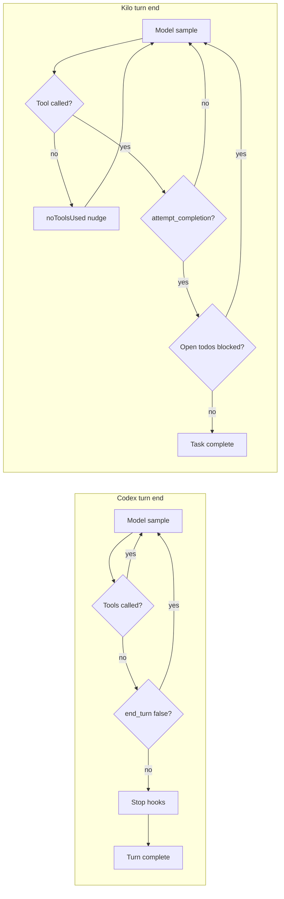

# Kilo Code vs Codex — Agent Principles, Harness & Config Inspiration

As-is comparison of **Kilo Code** (this monorepo: VS Code extension + JetBrains host) and **OpenAI Codex** (`codex-rs` agent runtime). Goal: surface hard-coded behavioral differences and map Codex strengths onto **Kilo-only configuration** (modes, prompts, rules, skills, settings) — no code changes.

| Audience | Teams tuning Kilo via setup/prompts/skills/rules/config who want Codex-like persistence and completion discipline |
| Scope | Current harness + prompt behavior in both codebases; recommendations are **config-only** |
| Out of scope | Forks, harness patches, new tools, Stop-hook ports |

Related docs:

- [`hard-coded-agent-constraints.md`](./hard-coded-agent-constraints.md) — Kilo code-only loop / tool / exploration limits
- [`kilo-code-prompts-write-update.md`](./kilo-code-prompts-write-update.md) — what Kilo can tune via prompts/modes vs harness
- [`agentic-flow-observation.md`](./agentic-flow-observation.md) — how to read Kilo session JSON against the harness model
- [`kilo-code-cursor-compare.md`](./kilo-code-cursor-compare.md) — similar comparison vs Cursor
- Codex (sibling repo): `codex/docs/codex-core-analysis.md`

---

## 1. High-level character

Both are **ReAct-style** coding agents: model samples, may emit tools, harness runs them, results return, loop continues. They differ in **tool surface**, **stop contract**, and **how much “finish the work” is hardwired vs prompt-shaped**.

| Dimension | Codex | Kilo Code |
|-----------|-------|-----------|
| Agent shape | Prompt-shaped **shell agent** | **IDE-integrated tool agent** (first-class read/search/edit tools) |
| Loop | Sample → (optional tools) → sample until stop | Streaming turn → **exactly one tool** → next turn |
| Stop signal | Assistant message + no tools (unless `end_turn=false` / hooks / pending input) | Model must call **`attempt_completion`** |
| Search | Via shell; instructions prefer `rg` / `rg --files` | Dedicated `read_file`, `search_files`, `list_files`, optional `codebase_search` |
| Language intelligence | None hardcoded (no LSP / classpath index) | Optional semantic index (tree-sitter + Qdrant); still no Maven/JAR resolution |
| Edits | Centralized verified **`apply_patch`** | Multiple paths: `apply_diff`, `write_to_file`, Fast Apply, optional `apply_patch` |
| Compile/lint/test after edit | Not automatic; model runs via shell | Same — model-driven via `execute_command` |
| First-turn free context | AGENTS.md + env + skills catalog; **no** recursive file tree | `environment_details` + **recursive workspace tree** (default **200** paths) |
| Completeness gate | Soft (prompts); optional **Stop hooks** | Soft (`attempt_completion`); optional **`preventCompletionWithOpenTodos`** |



**One-line takeaways**

- **Codex:** Hardwires sample/tools/sample with verified `apply_patch` and shell discovery; forces another round when tools run or `end_turn`/hooks demand it; task completeness is mostly **prompt + model**.
- **Kilo:** Hardwires **one tool per turn**, native tool protocol, and **`attempt_completion` as done**; first-class IDE tools + optional index; completeness is also **self-reported** unless todos-block is enabled.

---

## 2. Agentic loop & turn completion

### 2.1 Codex (`codex-rs/core` → `session/turn.rs`)

```
run_turn:
  prepare context (AGENTS.md, skills, world state, …)
  loop:
    drain pending/steered input; inject reminders
    run_sampling_request → { needs_follow_up, last_agent_message }
    if continue: maybe auto-compact; continue
    else: run Stop hooks → block+continuation OR turn complete
```

| Hard continue cause | Meaning |
|---------------------|---------|
| Any tool call handled | Must sample again with tool outputs |
| API `end_turn == false` | Another sample **without** tools |
| Pending / steered input | User input arrived mid-turn |
| Stop hook `decision: block` + reason | Inject continuation prompt; loop |
| Mailbox preempt (multi-agent v2) | Pending mail during commentary |

Plain assistant text / reasoning does **not** force follow-up. There is **no** terminal “done” tool. There is **no** max sampling-round counter that forces stop.

### 2.2 Kilo (`src/core/task/Task.ts`)

```
user message
  → initiateTaskLoop (while !abort)
    → build context + environment_details
    → streaming api.createMessage(...)
    → presentAssistantMessage (execute at most ONE tool)
    → tool_result or noToolsUsed nudge → next turn
```

| Hard continue / stop | Meaning |
|----------------------|---------|
| Zero tools in response | Inject fixed `noToolsUsed` text; after grace (`consecutiveNoToolUseCount >= 2`) counts as mistake |
| Tool (not completion) | Next API turn with tool result |
| `attempt_completion` | Task ends (unless blocked — see below) |
| Mistake / request / cost caps | Settings can stop the loop |
| No hard max iterations | Outer loop is `while (!abort)` |

Optional gate: setting **`preventCompletionWithOpenTodos`** (default **false**) blocks `attempt_completion` when the todo list still has incomplete items (`AttemptCompletionTool.ts`).

### 2.3 Soft persistence (prompt-only)

| Agent | Soft “keep working” policy |
|-------|----------------------------|
| **Codex** | Base instructions: *“Please keep going until the query is completely resolved, before ending your turn…”* (`protocol/.../base_instructions/default.md`). GPT-5.2-style prompts strengthen this further. |
| **Kilo** | Shared **OBJECTIVE**: iterative goals, one tool at a time, **must** call `attempt_completion` when done. No equivalent “keep going until completely resolved” clause in shared sections — that must come from custom instructions / rules. |

### 2.4 Shared failure mode (different mechanisms)

Observed in both ecosystems:

1. Model proposes many changes in chat  
2. Only some files are written via tools  
3. Remaining edits never become tool calls  
4. Agent yields as if finished  

| Ingredient | Codex | Kilo |
|------------|-------|------|
| Chat-only edits | Stop on assistant text; harness does **not** detect “proposed but not patched” | Chat never applied; but model can still `attempt_completion` after partial tools |
| Partial file set | No completeness check vs plan/chat | Same — `attempt_completion` does not verify planned files were edited |
| No compile/test | Prompt “Validating your work”; optional hooks | Prompt/rules only; no post-edit harness gate |

**Insight:** Codex can stop *without* a completion tool; Kilo *requires* a completion tool but does not verify edit coverage. Config can tighten Kilo’s soft policy; it cannot add Codex Stop hooks or multi-tool rounds.

---

## 3. Tool surface & execution model

| Capability | Codex | Kilo Code |
|------------|-------|-----------|
| Tools per model round | **Multiple** — parallel for shell/MCP/`view_image`; serial for `apply_patch`, `update_plan`, multi-agent | **Exactly one** — runtime-enforced (`parallelToolCallsEnabled = false`, `isMultipleNativeToolCallsEnabled = false`) |
| Read / list / grep | Via `exec_command` / shell | First-class `read_file`, `list_files`, `search_files`; prompt prefers tools over shell |
| Semantic search | None built-in | Optional `codebase_search` when index ready |
| Edit path | **`apply_patch`** only (custom patch language; context-match verify before write) | `apply_diff`, `write_to_file`, `edit_file` / Fast Apply, optional `apply_patch` / replace tools |
| Patch failure signal | Mismatch → error to model, no write; instructions say do not re-read after success | Format-specific; ApplyDiff match window `BUFFER_LINES = 40` |
| Planning checklist | `update_plan` (UI TODOs; soft — does not gate stop) | `update_todo_list` (+ optional completion block when open todos) |
| Terminal completion | No `attempt_completion` | **`attempt_completion`** required by OBJECTIVE |
| Subagents | Multi-agent v2 tools (`spawn_agent`, wait/send, …) | `new_task`, **orchestrator** mode, `@kilocode/agent-runtime` forks |
| Browser / MCP | Optional / MCP servers | `browser_action`, `use_mcp_tool` (mode-gated) |
| User Q&A mid-task | `request_user_input` (feature-gated); Plan Mode | `ask_followup_question` (removed in YOLO) |

**Biggest structural gap for multi-file work:** Kilo’s one-tool-per-turn cannot be lifted via settings or the `multipleNativeToolCalls` experiment (prompt text may claim multi-tool; executor still skips extras). Codex can batch several shell reads / one patch round more densely.

Exploration caps (Kilo hard-coded — see constraints doc): `list_files` 200; `search_files` 300 results / 500-char lines; read budget 60% remaining context. Codex relies on shell output + `tool_output_token_limit` instead of named tool caps.

---

## 4. Planning & modes

| Concept | Codex | Kilo Code |
|---------|-------|-----------|
| Plan-only | **Plan Mode** — template forbids mutating tracked files (soft prompt + UI; tools not hard-stripped) | **architect** — gather context / todos; edits limited to **`.md`** via `FileRestrictionError` |
| Implement | Default collaboration mode | **code** (default) — full read/edit/command |
| Q&A | Default agent (read via shell) | **ask** — no edit tool group |
| Debug | Prompt guidance in base instructions | **debug** — hypotheses → instrument → fix |
| Orchestration | Multi-agent spawn/wait tools | **orchestrator** — delegate via `new_task`; no direct edit groups |
| Review | Separate review-thread prompt | **review** (Kilo-specific) — read-oriented structured review |
| Checklist tool | `update_plan` — one `in_progress`; mark complete before yield (instructional) | `update_todo_list` — instructional unless `preventCompletionWithOpenTodos` |

**Workflow mapping (config):** Codex Plan Mode ≈ start in **architect**, produce plan/todos, then `switch_mode` → **code**. Architect’s `.md`-only edit rule is **harder** than Codex Plan Mode’s soft “do not mutate” policy.

---

## 5. Prompt principles — hard-coded vs tunable

### 5.1 Codex (base / model instructions)

Encoded mainly in `codex-rs/protocol/src/prompts/base_instructions/` and model-specific overlays (`gpt_5_2_prompt.md`, etc.):

| Principle | Hard in Codex prompts? | Notes |
|-----------|------------------------|-------|
| Persist until query fully resolved | Yes | Soft — not harness-enforced |
| Brief preamble before tool batches | Yes | Progress / momentum messaging |
| `update_plan` for non-trivial work | Yes | Exactly one `in_progress` |
| Prefer `rg` / `rg --files` | Yes | Shell-centric discovery |
| Use `apply_patch` only for edits | Yes | Never chat-only file mutation |
| Do not re-read after successful patch | Yes | Failure is the signal |
| Validate via tests/build/lint | Yes | Approval-mode nuances (proactive in `never`) |
| AGENTS.md nested scope / precedence | Yes | Nested wins; system/user beats AGENTS.md |
| No git commit/branch unless asked | Yes | |
| Ambition (greenfield) vs precision (existing repo) | Yes | |
| Final answer formatting (headers, file:line) | Yes | CLI-oriented |

Config overlays: `base_instructions`, `developer_instructions`, `instructions`, AGENTS.md, skills, collaboration-mode templates, permissions fragments, hooks.

### 5.2 Kilo (assembled system prompt)

Assembled in `src/core/prompts/system.ts` — roughly **~90% shared** across modes:

| Principle | Where | Tunable without code? |
|-----------|-------|------------------------|
| Exactly one tool per response | OBJECTIVE + tool-use-guidelines + **runtime** | Prompt yes / runtime **no** |
| Must `attempt_completion` | OBJECTIVE + RULES | Soft — completion tool required; coverage not verified |
| Prefer dedicated tools over terminal | tool-use-guidelines | Soft |
| Analyze `environment_details` first | OBJECTIVE | Soft |
| No filler (“Great”, “Certainly”) | RULES | Soft |
| Clickable markdown file links | MARKDOWN RULES | Soft |
| Cwd-relative paths; no lasting `cd` | RULES | Soft |
| Mode role / whenToUse | `packages/types/src/mode.ts` + custom modes | Yes |
| Skills applicability check | skills section | Yes (project/global skills) |
| User rules / AGENTS.md | USER'S CUSTOM INSTRUCTIONS | Yes |

**Footgun:** `.kilocode/system-prompt-{mode}` **replaces** the entire assembled catalog (tools, RULES, OBJECTIVE). Prefer mode `customInstructions` + `.kilocode/rules/` + `AGENTS.md` unless you re-include the full tool/objective stack.

### 5.3 Overlap

Neither harness, by default, asks: *Did you apply all intended file changes? Did the code compile? Did you run tests?* Completeness is **model + prompt** (plus Kilo’s optional open-todos gate and Codex’s optional Stop hooks).

---

## 6. Safety, sandbox & approvals

| Area | Codex | Kilo Code |
|------|-------|-----------|
| OS sandbox | Seatbelt / Linux sandbox / Windows levels; modes `read-only`, `workspace-write`, `danger-full-access` | No OS sandbox in the extension host; tools run with IDE/process privileges |
| Approval policy | `AskForApproval`: `never`, `unless-trusted`, `on-request`, `granular` | Per-class auto-approve: read/write/delete/browser/MCP/execute/mode-switch/subtasks/followups |
| Exec allow/deny | `~/.codex/rules/*.rules` + known-safe / dangerous prefixes | `allowedCommands` / `deniedCommands` prefix match; dangerous substitutions never auto-approved |
| Full auto | `approval_policy: never` (escalations rejected) | `yoloMode` (+ optional AI **gatekeeper** model) |
| Lifecycle hooks | Pre/Post tool, PermissionRequest, **Stop**, SubagentStop, SessionStart/End, Compact | **No** Stop/PreToolUse hook system |
| Write protection | Sandbox writable roots + policy | `RooProtectedController` (`.kilocode/**`, `AGENTS.md`, `.vscode/**`, …) |
| Ignore files | Product/ignore conventions | `.kilocodeignore` / `.rooignore` |

**Config inspiration gap:** Codex **Stop hooks** can refuse turn completion and inject a continuation auditor. Kilo’s closest built-in lever is **`preventCompletionWithOpenTodos`** plus strict completion rules — not a general Stop-hook runtime.

---

## 7. Context & discovery

| Mechanism | Codex | Kilo Code |
|-----------|-------|-----------|
| Project rules | `AGENTS.md` chain root→cwd (+ `$CODEX_HOME/AGENTS.md`); `project_doc_max_bytes` (default 32 KiB) | `AGENTS.md` / `AGENT.md` + `.kilocode/rules/` + `.kilocode/rules-{mode}/`; `useAgentRules`, `enableSubfolderRules` |
| Skills | `.agents/skills/`, `$CODEX_HOME/skills/`; catalog at start; full body on `@` mention | `.kilocode/skills/`, `.kilocode/skills-{mode}/`, `~/.kilocode/skills/`; catalog in prompt + applicability check |
| Repo / semantic index | None | Optional codebase index (1 MB file cap, ~1000-char chunks) |
| First-turn file tree | No | Yes — `maxWorkspaceFiles` (default 200; `0` disables) |
| Compaction | Auto-compact + Pre/PostCompact hooks; remote compact paths | Auto-condense (keeps last **3** messages); truncate hides ~50% of middle |
| World / permissions context | Injected `<environment_context>`, permissions instructions (diffed via WorldState) | `environment_details` + system info each turn |
| Maven / external deps | Not first-class | Not first-class; project pattern: deps catalog under `.kilocode/` + rules (see prompts-write-update doc) |

---

## 8. Configuration surfaces

| Intent | Codex | Kilo Code |
|--------|-------|-----------|
| Global behavior | `~/.codex/config.toml` (+ profiles) | VS Code / JetBrains settings (`packages/types` global-settings), provider profile |
| Project rules | `AGENTS.md`, project `.codex/config.toml` | `AGENTS.md`, `.kilocode/rules/*.md` |
| Skills | `SKILL.md` under skill roots; skills config in TOML | `.kilocode/skills/*/SKILL.md` |
| Mode / persona | `collaboration_mode` (Default / Plan), profiles | Built-in modes + `.kilocodemodes` / `custom_modes.yaml` + UI `customModePrompts` |
| Prompt override | `base_instructions`, `developer_instructions`, `model_instructions_file` | Mode `roleDefinition` / `customInstructions`; full override via `.kilocode/system-prompt-{mode}` (footgun) |
| Per-turn overrides | app-server `turn/start` sticky fields | Task-level settings; no per-turn API twin |
| Workflows | Hooks | `.kilocode/workflows/*.md` (orchestrator-friendly) |
| Stop / completeness auditor | Stop hooks | `preventCompletionWithOpenTodos` + rules / todos |
| Approvals | approval_policy, sandbox_mode, permissions profiles | `alwaysAllow*`, `allowedCommands` / `deniedCommands`, YOLO + gatekeeper |
| MCP | `mcp_servers` in config | MCP hub / server config in extension |

---

## 9. Codex → Kilo inspiration matrix (no-code)

Use these levers only: **Code-mode customInstructions**, **`.kilocode/rules/`**, **`AGENTS.md`**, **skills**, **modes**, **settings**. Do not replace the full system prompt unless you re-include TOOL USE / RULES / OBJECTIVE.

### 9.1 High-value mappings

| Codex principle | Kilo config lever | Concrete proposal |
|-----------------|-------------------|-------------------|
| Keep going until completely resolved | `.kilocode/rules/completion.md` or Code `customInstructions` | Require: finish all planned file edits via tools; do **not** call `attempt_completion` until edits are on disk and validation (below) is done. Re-state after any partial plan. |
| Validate before yield | `AGENTS.md` + rules | Project-specific: e.g. `mvn -q -DskipTests compile` / targeted tests / `pnpm check-types` before completion. Prefer narrow then broader (Codex validation philosophy). |
| `update_plan` discipline | Enable `todoListEnabled`; use `update_todo_list`; set **`preventCompletionWithOpenTodos: true`** | One in-progress item; mark complete as you go; completion blocked while open — closest harness twin to Codex plan gating. |
| Plan before large edits | Start in **architect**; rule: `switch_mode` to **code** only after plan/todos exist | Mimics Plan Mode → implement. Architect already hard-blocks non-`.md` edits. |
| Preamble / progress updates | Code `customInstructions` | Before each tool: 1–2 sentences (what just finished, what next). Avoid filler praise. |
| Prefer ripgrep for exact symbols | `.kilocode/rules/search.md` | Use `search_files` for exact symbols/strings; `codebase_search` only for semantic/unknown-location questions; avoid `execute_command` for `grep`/`find` when dedicated tools exist. |
| Do not re-read after successful edit | `.kilocode/rules/edits.md` | After successful `apply_diff` / `write_to_file` / Fast Apply, do not `read_file` the same path unless the tool reported failure or you need a different region. |
| Approval-mode test behavior | Auto-approve execute + rules | When `alwaysAllowExecute` (or YOLO): proactively run the project’s test/lint commands before `attempt_completion`. When interactive approvals: propose the command and wait. |
| Nested AGENTS.md scoping | Already supported | Adopt Codex layout: root `AGENTS.md` + module-level files; document “nested wins for that tree.” Enable `enableSubfolderRules` if needed. |
| No git commit/branch unless asked | `.kilocode/rules/git.md` | Copy Codex: never `git commit`, create branches, or push unless the user explicitly asks. |
| Ambition vs precision | Code `customInstructions` | Greenfield: reasonable creativity. Existing codebase: surgical diffs; no drive-by refactors or unrelated test fixes. |
| Skills on demand | `.kilocode/skills/<name>/SKILL.md` | Port recurring Codex workflows (review checklist, test strategy, translation) into Kilo skills; keep frontmatter `name` + `description` accurate so the applicability check fires. |
| Safe exec prefixes | `allowedCommands` / `deniedCommands` | Allow read-only / CI-like prefixes (`rg`, `mvn -q test`, `pnpm test`, `git status`, `git diff`); deny destructive patterns you never want auto-run. |
| Stop-hook completeness audit | **Not available** | Best-effort: completion rule + open-todos block + mandatory validation commands. Document as harness gap. |

### 9.2 Example rule snippets (illustrative)

**`.kilocode/rules/completion.md`** (adapt to your stack):

```markdown
# Task completion

- Keep working until the user request is fully implemented on disk.
- Never describe remaining file edits only in chat — apply them with edit tools first.
- Before attempt_completion:
  1. Confirm every planned file was edited via tools (or explicitly skipped with reason).
  2. Run the project validation command(s) listed in AGENTS.md when execute is allowed.
  3. If todos are in use, leave none incomplete.
- In attempt_completion, list modified files and what was verified.
```

**Settings checklist (Kilo UI / `settings.json`):**

| Setting | Suggested when aiming for Codex-like persistence |
|---------|--------------------------------------------------|
| `todoListEnabled` | `true` |
| `kilo-code.preventCompletionWithOpenTodos` | `true` |
| `alwaysAllowExecute` + `allowedCommands` | On for trusted CI-like prefixes if you want proactive validation |
| `consecutiveMistakeLimit` | Raise if early stop from mistake path is too aggressive (default 3; `0` = unlimited) |
| `useAgentRules` | `true` (default) |
| Mode | **code** for implementation; **architect** first for large/ambiguous work |

### 9.3 Cannot replicate without code (harness gaps)

| Codex capability | Why Kilo config cannot match |
|------------------|------------------------------|
| Multiple / parallel tools per sample | Runtime forces one tool; experiment does not enable execution |
| `end_turn: false` continue-without-tools | No equivalent API/harness flag in Kilo loop |
| Stop hooks blocking turn end | No lifecycle hook runtime |
| OS sandbox (Seatbelt / Linux / Windows) | Extension host is not sandboxed like Codex exec |
| Single verified `apply_patch` pipeline for all edits | Multiple edit tools; chat never applied; no unified context-match gate for all paths |
| WorldState permission/env fragment diffs | Different context assembly (`environment_details`) |
| Shell-as-primary exploration with auto-approved `rg` | Kilo intentionally prefers dedicated tools; shell is secondary |

---

## 10. Failure modes & mitigations

Aligned with Codex analysis §9 and Kilo [`kilo-code-prompts-write-update.md`](./kilo-code-prompts-write-update.md) Symptom 1.

| Failure ingredient | Codex mitigation | Kilo mitigation | Config-only fix on Kilo? |
|--------------------|------------------|-----------------|--------------------------|
| Edits only in chat, not on disk | Prompt: use `apply_patch`; no write_file alternative | Native tools only; prose never applied; `noToolsUsed` nudge | **Partial** — stronger “must use edit tools” rules; correct mode (not Ask/Architect for code) |
| Partial file set applied | No harness completeness check | Same for files; optional open-todos block | **Partial** — todos + `preventCompletionWithOpenTodos` + completion rules |
| Syntax / compile errors left | Patch context-match only; compile via shell | Diff match window; compile via `execute_command` | **Partial** — AGENTS.md validation commands |
| No tests written/run | Prompt validation + approval nuances | Prompt/rules only | **Partial** — rules + auto-approve execute |
| Agent yields early | Persist prompt; Stop hooks; `end_turn=false` | Must call `attempt_completion`; mistake/cost caps | **Partial** — persist rules; todos gate; **no** Stop hooks |
| Multi-file thrash / give-up | Parallel tools reduce round-trips | One tool/turn → many round-trips | **No** — structural |

---

## 11. Quick reference & source map

### 11.1 Mental model

```
┌────────────────────────────────────────────────────────────┐
│ CODEX — hard                                              │
│  • Multi-tool samples; parallel shell/MCP                 │
│  • Continue on tools / end_turn=false / Stop-hook block   │
│  • Verified apply_patch; shell discovery                  │
│  • Completeness ≈ prompts (+ optional hooks)              │
└────────────────────────────────────────────────────────────┘

┌────────────────────────────────────────────────────────────┐
│ KILO — hard                                               │
│  • Exactly 1 tool executed per assistant message          │
│  • Native protocol for new tasks; attempt_completion=done │
│  • First-class read/search/edit + optional code index     │
│  • Fixed list/search/read/condense caps                   │
└────────────────────────────────────────────────────────────┘
         ▲ modes / rules / skills / settings tune soft policy
```

### 11.2 Source map

| Topic | Codex | Kilo |
|-------|-------|------|
| Outer loop | `codex-rs/core/src/session/turn.rs` | `src/core/task/Task.ts` |
| Tool execution / parallelism | `tools/parallel.rs`, `tools/spec_plan.rs` | `presentAssistantMessage.ts` |
| Stop / completion | Stop hooks (`hook_runtime.rs`); no done-tool | `AttemptCompletionTool.ts`; `preventCompletionWithOpenTodos` |
| Base instructions | `protocol/src/prompts/base_instructions/default.md` | `src/core/prompts/system.ts` + `sections/*` |
| Plan mode | `collaboration-mode-templates/templates/plan.md` | Architect in `packages/types/src/mode.ts` |
| Patch pipeline | `codex-rs/apply-patch/` | `src/core/diff/`, edit tools under `src/core/tools/` |
| Config | `~/.codex/config.toml`, app-server v2 | Global settings, `.kilocode/`, `.kilocodemodes` |
| Analysis doc | `codex/docs/codex-core-analysis.md` | `exploring-docs/hard-coded-agent-constraints.md` |

### 11.3 One-line summaries

- **Codex:** Sample/tools/sample loop with verified `apply_patch` and shell-based exploration; hard-continues on tools / `end_turn` / input / Stop hooks; whether the coding task is actually complete is left to the model, prompts, and optional hooks.
- **Kilo:** Streaming one-tool-per-turn IDE agent with first-class read/search/edit tools and self-reported `attempt_completion`; hard caps on exploration and context; soft completeness via prompts, with optional open-todos blocking — tunable via modes, rules, skills, and settings without forking.

### 11.4 Practical recommendation

To make Kilo feel closer to Codex’s **persistence + validate-before-yield** culture **without code changes**:

1. Add completion + validation + git + edit-discipline rules under `.kilocode/rules/`.  
2. Enable todos + **`preventCompletionWithOpenTodos`**.  
3. Put stack-specific commands in `AGENTS.md`.  
4. Use **architect → code** for large work.  
5. Accept that **one-tool-per-turn**, **no Stop hooks**, and **no OS sandbox** remain structural differences.
