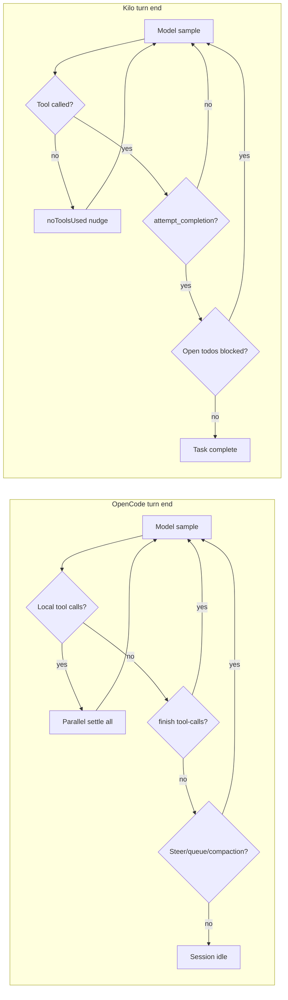

# Kilo Code vs OpenCode — Agent Principles, Harness & Config Inspiration

As-is comparison of **Kilo Code** (this monorepo: VS Code extension + JetBrains host) and **OpenCode** (`packages/opencode` V1 production + `packages/core` V2 target). Goal: surface hard-coded behavioral differences and map OpenCode strengths onto **Kilo-only configuration** (modes, prompts, rules, skills, settings) — no code changes.

| Audience | Teams tuning Kilo via setup/prompts/skills/rules/config who want OpenCode-like planning, validation, or subagent patterns |
| Scope | Current harness + prompt behavior in both codebases; recommendations are **config-only** |
| Out of scope | Forks, harness patches, new tools, OpenCode plugin ports |

Related docs:

- [`hard-coded-agent-constraints.md`](./hard-coded-agent-constraints.md) — Kilo code-only loop / tool / exploration limits
- [`kilo-code-prompts-write-update.md`](./kilo-code-prompts-write-update.md) — what Kilo can tune via prompts/modes vs harness
- [`agentic-flow-observation.md`](./agentic-flow-observation.md) — how to read Kilo session JSON against the harness model
- [`kilo-code-codex-compare.md`](./kilo-code-codex-compare.md) — similar comparison vs OpenAI Codex
- [`kilo-code-cursor-compare.md`](./kilo-code-cursor-compare.md) — similar comparison vs Cursor
- OpenCode (sibling repo): `opencode/docs/opencode-core-analysis.md`

---

## 1. High-level character

Both are **ReAct-style** coding agents: model samples, may emit tools, harness runs them, results return, loop continues. They differ in **stop contract**, **tools per turn**, **mode enforcement**, and **how much validation is harness-fed vs prompt-only**.

| Dimension | OpenCode | Kilo Code |
|-----------|----------|-----------|
| Agent shape | **CLI/TUI agent** with model-specific system prompts | **IDE-integrated tool agent** with ~90% shared prompt stack |
| Loop | Sample → parallel tool settlement → sample until idle | Streaming turn → **exactly one tool** → next turn |
| Stop signal | Provider `finish: stop` (or non-`tool-calls`) + no pending local tools | Model must call **`attempt_completion`** |
| Tools per round | **Multiple**, parallel settlement | **Exactly one** — runtime-enforced |
| Search | `grep` / `glob` / `read` (ripgrep-backed) | `read_file`, `search_files`, `list_files`, optional `codebase_search` |
| Edits | `edit`, `write`, or `apply_patch` (GPT default) | `apply_diff`, `write_to_file`, Fast Apply, optional `apply_patch` |
| Post-edit feedback | Auto-format + **LSP diagnostics in tool output** (V1) | No LSP in edit tool output; diagnostics via `environment_details` |
| First-turn free context | Env block + instructions; **no** recursive file tree | `environment_details` + **recursive workspace tree** (default **200** paths) |
| Completeness gate | None — model decides when to stop | Soft (`attempt_completion`); optional **`preventCompletionWithOpenTodos`** |
| Subagents | `task` tool → child session (explore / general / custom) | `new_task` → delegated **Task**; **orchestrator** mode; agent-runtime forks |



**One-line takeaways**

- **OpenCode:** Multi-tool parallel rounds; stops when the model stops calling tools; no completion verifier; mitigations are **soft** (model-specific prompts, LSP in edit output, doom-loop ask, plan/build split).
- **Kilo:** One-tool-per-turn IDE agent with **`attempt_completion` as done**; mode = hard tool ACL; mandatory skills pre-check; completeness is **self-reported** unless todos-block is enabled.

---

## 2. Agentic loop & turn completion

### 2.1 OpenCode (V1 production: `packages/opencode/src/session/prompt.ts`)

```
runLoop:
  exit check (before next sample)
  → one llm.stream() per iteration
  → SessionProcessor: parallel tool settlement
  → continue / stop / compact
  → repeat until exit check passes → session idle
```

| Hard continue cause | Meaning |
|---------------------|---------|
| Local tool calls in last turn | Must sample again with tool outputs |
| Provider `finish: tool-calls` | Another turn for pending results |
| Provider quirk: `finish: stop` but tool parts exist | Loop keeps running |
| Compaction / overflow | Sub-loop or `"compact"` result |
| Subtask message in queue | Internal task handling |
| Steer / queue input (V2) | User input at safe boundary |
| Step limit reached | Tools disabled; one final text-only turn with `MAX_STEPS_PROMPT` |

**No terminal “done” tool.** Plain assistant text with `finish: stop` and no tools → **session idle**.

There is **no** runtime check for: all planned files edited, compile success, tests run, LSP errors zero, todos complete.

### 2.2 Kilo (`src/core/task/Task.ts`)

```
user message
  → initiateTaskLoop (while !abort)
    → build context + environment_details
    → streaming api.createMessage(...)
    → presentAssistantMessage (execute at most ONE tool)
    → tool_result or noToolsUsed nudge → next turn
```

| Hard continue / stop | Meaning |
|----------------------|---------|
| Zero tools in response | Inject fixed `noToolsUsed` text; after grace (`consecutiveNoToolUseCount >= 2`) counts as mistake |
| Tool (not completion) | Next API turn with tool result |
| `attempt_completion` | Task ends (unless blocked) |
| Mistake / request / cost caps | Settings can stop the loop |
| No hard max iterations | Outer loop is `while (!abort)` |

Optional gate: **`preventCompletionWithOpenTodos`** blocks `attempt_completion` when todos remain incomplete.

### 2.3 Soft persistence (prompt-only)

| Agent | Soft “keep working” policy |
|-------|----------------------------|
| **OpenCode** | **Model-dependent.** `beast.txt` (GPT-4/o-series): *“MUST iterate until problem is solved”*, todo completion. `gemini.txt`: explicit 5-step verify (tests + lint/typecheck). `codex.txt`: moderate — proceed without asking; suggest verify steps. `default.txt`: *“Run lint/typecheck when done”* — prompt only. |
| **Kilo** | Shared **OBJECTIVE**: iterative goals, one tool at a time, **must** call `attempt_completion` when done. No built-in “keep going until completely resolved” clause — must come from custom instructions / rules. |

**Structural insight:** OpenCode can stop *without* any completion ceremony; Kilo *requires* `attempt_completion` but does not verify edit coverage. Both share the **chat-only proposals → early done** failure mode; OpenCode stops on assistant text, Kilo can still `attempt_completion` after partial tools.

---

## 3. Tool surface & execution model

| Capability | OpenCode | Kilo Code |
|------------|----------|-----------|
| Tools per model round | **Multiple** — parallel settlement before next sample | **Exactly one** — `parallelToolCallsEnabled = false`, executor skips extras |
| Read / list / grep | `read`, `grep`, `glob` | `read_file`, `list_files`, `search_files`; prompt prefers tools over shell |
| Semantic search | None built-in | Optional `codebase_search` when index ready |
| Edit path | `edit` (fuzzy match V1), `write`, or **`apply_patch`** (GPT default) | `apply_diff`, `write_to_file`, `edit_file` / Fast Apply, optional `apply_patch` |
| Post-edit harness | Auto-format + **LSP diagnostics appended to edit tool output** (V1) | No automatic LSP in edit result |
| Planning checklist | `todo` tool (session todo list) | `update_todo_list` (+ optional completion block) |
| Terminal completion | No completion tool | **`attempt_completion`** required by OBJECTIVE |
| Subagents | `task` tool → child session (`explore`, `general`, custom `.opencode/agent/*.md`) | `new_task` → delegated Task; **orchestrator** mode; `@kilocode/agent-runtime` |
| Browser / web | `fetch`, `search` (provider-gated) | `browser_action`, MCP |
| User Q&A | `question` tool (client-gated) | `ask_followup_question` |
| Doom / repeat detection | Same tool+args **3×** → permission `doom_loop` ask | Identical-tool repetition tied to **consecutive mistake limit** (default 3) |

**Biggest structural gap:** Kilo’s one-tool-per-turn cannot be lifted via settings or the `multipleNativeToolCalls` experiment. OpenCode can batch several grep/read calls or one patch round in a single provider turn.

Exploration caps (Kilo hard-coded): `list_files` 200; `search_files` 300 results / 500-char lines; read budget 60% remaining context. OpenCode uses `tool_output` truncation (default 2000 lines / 51200 bytes) instead of named tool caps.

---

## 4. Planning, modes & agent types

| Concept | OpenCode | Kilo Code |
|---------|----------|-----------|
| Plan-only | **plan** agent — edits denied except `.opencode/plans/*.md` (permission) | **architect** — gather context / todos; edits limited to **`.md`** via `FileRestrictionError` |
| Implement | **build** (default primary) | **code** (default) — full read/edit/command |
| Q&A / read-only explore | Default agent or **explore** subagent (grep/glob/read only) | **ask** — no edit tool group |
| Debug | Prompt guidance in model-specific files | **debug** — hypotheses → instrument → fix |
| Orchestration | `task` tool with custom subagents | **orchestrator** — delegate via `new_task`; no direct edit groups |
| Review | Prompt / slash commands | **review** (Kilo-specific) — git-based structured review |
| Checklist tool | `todo` — instructional; does not gate stop | `update_todo_list` — instructional unless `preventCompletionWithOpenTodos` |
| Plan → build handoff | Synthetic reminders + `plan_exit` tool (experimental) | **`switch_mode`** architect → code (prompt + runtime ACL) |
| Agent definition | `.opencode/agent/*.md` frontmatter + body **replaces** model prompt | `.kilocodemodes` / UI: `roleDefinition`, `customInstructions`, tool **groups** |

**Workflow mapping (config):** OpenCode plan → build ≈ Kilo **architect** → **code** via `switch_mode`. Both enforce plan-phase edit restrictions at runtime (OpenCode via permissions, Kilo via `fileRegex` on edit group).

**OpenCode advantage:** Custom subagents as markdown files with independent permissions and prompts. **Kilo advantage:** Richer built-in mode catalog (debug, review, orchestrator) with hard tool ACLs.

---

## 5. Prompt principles — hard-coded vs tunable

### 5.1 OpenCode (model-specific + agent override)

Selected in `packages/opencode/src/session/system.ts`; merged in `llm/request.ts`:

| Principle | Where | Tunable without code? |
|-----------|-------|----------------------|
| Persist until solved | `beast.txt`, partially `gemini.txt` | Agent `prompt` can replace; or pick model family |
| 5-step verify workflow | `gemini.txt` | Port to Kilo rules / Code `customInstructions` |
| Proceed without permission questions | `codex.txt` | Rules / mode instructions |
| Parallel grep/glob in Understand phase | `gemini.txt`, `default.txt` | Kilo cannot parallelize — prompt can still say “batch mentally, one tool per turn” |
| Conventions / libraries / style mimicry | All prompt files | `.kilocode/rules/` |
| TodoWrite emphasis | `anthropic.txt` | `update_todo_list` + rules |
| No git reset --hard unless asked | Prompt hygiene rules | `.kilocode/rules/git.md` |
| Agent `prompt` | `.opencode/agent/*.md` | **Replaces** model prompt entirely |
| Plan mode injection | `reminders.ts` + `plan-mode.txt` | Architect `customInstructions` + mode switch rules |

Config overlays: `opencode.json(c)`, `instructions[]`, `AGENTS.md`, skills catalog, MCP instructions, per-message `user.system`.

### 5.2 Kilo (assembled system prompt)

Assembled in `src/core/prompts/system.ts` — roughly **~90% shared** across modes:

| Principle | Where | Tunable without code? |
|-----------|-------|----------------------|
| Exactly one tool per response | OBJECTIVE + tool-use + **runtime** | Prompt yes / runtime **no** |
| Must `attempt_completion` | OBJECTIVE + RULES | Soft — completion tool required; coverage not verified |
| Prefer dedicated tools over terminal | tool-use-guidelines | Soft |
| Analyze `environment_details` first | OBJECTIVE | Soft |
| Mandatory skills applicability check | skills section | Yes (project/global skills) |
| No filler (“Great”, “Certainly”) | RULES | Soft |
| Mode role / whenToUse | `packages/types/src/mode.ts` + custom modes | Yes |
| User rules / AGENTS.md | USER'S CUSTOM INSTRUCTIONS | Yes |

**Footgun (both products):** Full system prompt override (`.kilocode/system-prompt-{mode}` or OpenCode agent `prompt`) **replaces** the tool catalog and shared sections — re-include TOOL USE / RULES / OBJECTIVE manually.

### 5.3 Overlap & divergence

| Topic | OpenCode | Kilo |
|-------|----------|------|
| Completion verifier | None | None (except optional open-todos block) |
| Validation before idle | Prompt only (strongest on gemini/beast) | Prompt/rules only |
| Edit feedback loop | LSP in tool output → model *may* fix next turn | IDE context in `environment_details`; no edit-tool LSP |
| Chat-only file mutation | Stops loop; prose not applied | Stops success path only via `noToolsUsed`; prose never applied |

---

## 6. Safety, sandbox & approvals

| Area | OpenCode | Kilo Code |
|------|----------|-----------|
| OS sandbox | **No** OS-level sandbox for bash (user shell in workspace) | **No** OS sandbox; VS Code integrated terminal |
| Approval model | `allow` / `ask` / `deny` permission rules; last match wins | Per-class auto-approve: read/write/delete/browser/MCP/execute/mode-switch/subtasks |
| Edit preview | Diff preview in permission metadata before apply | UI approval per write; protected-file extra gate |
| Doom loop | 3× identical tool+args → `doom_loop` permission ask | Mistake counter + identical-tool detector |
| Full auto | `permission.*: allow` globally or per-agent | `yoloMode` (+ optional AI **gatekeeper** model) |
| Exec allow/deny | `permission.bash` patterns + `BashArity` | `allowedCommands` / `deniedCommands` prefix match |
| Lifecycle hooks | Plugin hooks (`chat.system.transform`, etc.) | **No** Stop/PreToolUse hook system |
| Write protection | Permission rules + external_directory checks | `RooProtectedController` (`.kilocode/**`, `AGENTS.md`, `.vscode/**`, …) |
| Ignore files | `.gitignore` respected by ripgrep | `.kilocodeignore` / `.rooignore` |
| Loop on permission deny | Default **stop** (`continue_loop_on_deny` experimental) | Rejection → tool error; loop continues unless user aborts |

**Parity note:** Neither product sandboxes shell execution by default. Both rely on approval policy + prompt hygiene.

---

## 7. Context & discovery

| Mechanism | OpenCode | Kilo Code |
|-----------|-------|-----------|
| Project rules | Walk-up `AGENTS.md` / `CLAUDE.md` — **first match wins** (not stacked at cwd) | `AGENTS.md` / `AGENT.md` + `.kilocode/rules/` + `.kilocode/rules-{mode}/`; `useAgentRules`, `enableSubfolderRules` |
| Nested rules on read | Parent-dir `AGENTS.md` injected when reading files under tree (once per assistant message) | Subfolder rules via `enableSubfolderRules` |
| Skills | `.opencode/skill(s)/**/SKILL.md`, Claude/agents paths; **`skill` tool** loads body | `.kilocode/skills/`, `skills-{mode}/`, `~/.kilocode/skills/`; catalog in prompt + **mandatory pre-check** |
| Repo / semantic index | None | Optional codebase index (1 MB file cap, ~1000-char chunks) |
| First-turn file tree | No | Yes — `maxWorkspaceFiles` (default 200; `0` disables) |
| Compaction | Auto on overflow; prune old tool outputs; hidden compaction agent | Auto-condense (keeps last **3** messages); truncate hides ~50% of middle |
| IDE context | Env block (cwd, git, platform, date, references) | `environment_details`: open tabs, visible editors, git, terminal output, todos, cost |
| Extra directories | `config.references[]` | `@` mentions, file context tracker |
| LSP | Optional `lsp` tool + post-edit diagnostics | Not exposed as agent tool |

---

## 8. Configuration surfaces

| Intent | OpenCode | Kilo Code |
|--------|----------|-----------|
| Global behavior | `~/.config/opencode/opencode.json(c)` (+ profiles) | VS Code / JetBrains settings (`packages/types` global-settings), provider profile |
| Project config | Walk-up `opencode.json(c)` | `.kilocode/` layout + extension settings |
| Project rules | `AGENTS.md`, `instructions[]` | `AGENTS.md`, `.kilocode/rules/*.md` |
| Skills | `SKILL.md` under skill roots; `skills.paths[]` | `.kilocode/skills/*/SKILL.md` |
| Mode / persona | `.opencode/agent/*.md`, `agent.<name>` in JSON | Built-in modes + `.kilocodemodes` / `custom_modes.yaml` + UI overrides |
| Prompt override | Agent `prompt` replaces model prompt | Mode `roleDefinition` / `customInstructions`; full override via `.kilocode/system-prompt-{mode}` |
| Slash workflows | `.opencode/command/**/*.md` (shell `!` injection) | `.kilocode/workflows/*.md` + built-in slash commands |
| Permissions / approvals | `permission` ruleset in config | `alwaysAllow*`, `allowedCommands` / `deniedCommands`, YOLO + gatekeeper |
| Tool disable | `tools.<id>: false` | Mode tool groups + experiments |
| Step cap | `agent.steps` → forced text summary | No equivalent setting |
| MCP | `mcp` in config | MCP hub / server config in extension |
| Subagent depth | `subagent_depth` (default 1) | Subtask delegation (no depth config) |
| Custom tools | `.opencode/tool/*.ts`, plugins | MCP servers; no first-class JS tool registry |

---

## 9. OpenCode → Kilo inspiration matrix (no-code)

Use these levers only: **Code-mode customInstructions**, **`.kilocode/rules/`**, **`AGENTS.md`**, **skills**, **modes**, **settings**. Do not replace the full system prompt unless you re-include TOOL USE / RULES / OBJECTIVE.

### 9.1 High-value mappings

| OpenCode principle | Kilo config lever | Concrete proposal |
|--------------------|-------------------|-------------------|
| Gemini 5-step verify (Understand → Plan → Implement → Test → Lint) | `.kilocode/rules/verify-workflow.md` + `AGENTS.md` | Document project test/lint/build commands; require running them before `attempt_completion` when execute is allowed. |
| Beast “MUST iterate until solved” | Code `customInstructions` + completion rule | *“Do not call attempt_completion until every planned edit is on disk and validation commands passed.”* |
| Plan before large edits | Start in **architect**; rule: `switch_mode` → **code** only after plan/todos | Mimics OpenCode plan → build. Architect already hard-blocks non-`.md` edits. |
| Explore subagent pattern | **Ask** mode or orchestrator `new_task` with read-only child | Delegate “map the codebase” subtasks via `new_task` in Ask/architect mode before Code implementation. |
| Todo discipline | Enable `todoListEnabled`; **`preventCompletionWithOpenTodos: true`** | Closest harness twin to OpenCode todo emphasis in `anthropic.txt`. |
| Conventions / library verification | `.kilocode/rules/conventions.md` | Port OpenCode Core Mandates: check imports, `package.json`/`pom.xml` before adding dependencies. |
| Parallel discovery mindset | `.kilocode/rules/search.md` | OpenCode encourages parallel grep/glob; Kilo must serialize — rule: *“Queue reads/search in priority order; do not attempt_completion until all discovery steps done.”* |
| Do not re-read after successful edit | `.kilocode/rules/edits.md` | After successful apply_diff/write_to_file, skip re-read unless tool failed or different region needed. |
| Proceed without permission questions (codex.txt) | Code `customInstructions` (when YOLO/auto-execute) | *“Choose reasonable defaults; run validation commands without asking when auto-approved.”* |
| Doom loop awareness | Raise `consecutiveMistakeLimit` carefully + rules | If agent repeats identical failing tool, change strategy; document in rules (OpenCode asks via permission). |
| Nested AGENTS.md | Already supported | Enable `enableSubfolderRules`; adopt module-level `AGENTS.md` for monorepo packages. |
| Skills on demand | `.kilocode/skills/<name>/SKILL.md` | Port OpenCode skills (commit workflow, test strategy); Kilo already mandates applicability check — keep descriptions precise. |
| Safe exec prefixes | `allowedCommands` / `deniedCommands` | Allow CI-like prefixes (`pnpm test`, `mvn -q test`, `rg`, `git status`); deny destructive patterns. |
| New-app scaffold workflow | Architect plan + Code mode rule | Port OpenCode “New Applications” sequence as a skill or workflow under `.kilocode/workflows/`. |
| LSP feedback after edit | **Not available in tool output** | Best-effort: rule to run project linter/typecheck via `execute_command` after edits; put commands in `AGENTS.md`. |
| Step limit summary | **No `agent.steps` equivalent** | Use orchestrator + todos; completion rule lists remaining work if blocked by mistake/cost caps. |

### 9.2 Example rule snippets (illustrative)

**`.kilocode/rules/verify-workflow.md`** (adapt stack):

```markdown
# Verify before completion (inspired by OpenCode gemini.txt)

Follow this sequence for non-trivial tasks:
1. **Understand** — search_files / read_file / list_files (one tool per turn).
2. **Plan** — use update_todo_list or architect mode for multi-file work.
3. **Implement** — apply all edits via edit tools; never leave changes in chat only.
4. **Test** — run project test command from AGENTS.md when execute is allowed.
5. **Standards** — run lint/typecheck/build command from AGENTS.md before attempt_completion.

In attempt_completion, list modified files and what was verified.
```

**`.kilocode/rules/subagent-delegation.md`** (explore pattern):

```markdown
# Exploration delegation

For broad codebase mapping (>5 unknown areas):
- Use orchestrator mode or new_task in Ask mode with a focused prompt.
- Wait for subtask completion before switching to Code mode for edits.
- Do not attempt_completion on the parent until subtask findings are incorporated.
```

**Settings checklist (Kilo UI / `settings.json`):**

| Setting | Suggested when aiming for OpenCode-like discipline |
|---------|---------------------------------------------------|
| `todoListEnabled` | `true` |
| `kilo-code.preventCompletionWithOpenTodos` | `true` |
| `alwaysAllowExecute` + `allowedCommands` | On for trusted validation prefixes |
| `consecutiveMistakeLimit` | Default 3; raise only if doom-loop false positives |
| `useAgentRules` | `true` (default) |
| `enableSubfolderRules` | `true` for monorepos |
| Mode flow | **architect** → **code** for large work; **orchestrator** for parallel exploration |

### 9.3 Cannot replicate without code (harness gaps)

| OpenCode capability | Why Kilo config cannot match |
|---------------------|------------------------------|
| Multiple / parallel tools per sample | Runtime forces one tool; experiment does not enable execution |
| LSP diagnostics in edit tool output | No post-edit LSP injection in edit tools |
| Permission rules engine (`allow`/`ask`/`deny` last-match) | Different model: boolean auto-approve flags + YOLO |
| Agent `prompt` replaces model-specific stack cleanly | Kilo mode overrides merge into shared ~90% stack (unless full file override footgun) |
| `agent.steps` forced summary turn | No step-cap setting |
| Background subagents (`OPENCODE_EXPERIMENTAL_BACKGROUND_SUBAGENTS`) | Subtasks block parent unless delegated pattern used |
| Custom JS/TS tools + plugins | MCP only in Kilo |
| Filesystem snapshots / undo | Kilo has git **checkpoints** per task (different mechanism) |
| Steer vs queue input delivery | Kilo message queue is simpler (post-condense drain) |
| `skill` tool lazy-load vs catalog | Kilo injects catalog + mandatory pre-check (different UX) |

---

## 10. Failure modes & mitigations

| Failure ingredient | OpenCode mitigation | Kilo mitigation | Config-only fix on Kilo? |
|--------------------|----------------------|-----------------|--------------------------|
| Edits only in chat, not on disk | Loop stops on text; no write path from chat | Native tools only; `noToolsUsed` nudge | **Partial** — verify-workflow + completion rules |
| Partial file set applied | No harness completeness check | Same; optional open-todos block | **Partial** — todos + `preventCompletionWithOpenTodos` |
| Syntax errors after edit | LSP in edit tool output; model may fix | Re-read / lint via execute_command | **Partial** — AGENTS.md validation commands |
| No tests written/run | Strong on gemini/beast prompts | Prompt/rules only | **Partial** — verify-workflow rule |
| Agent yields early | Model-specific persist prompts | Must call `attempt_completion` | **Partial** — persist rules; todos gate |
| Repeated identical failing tool | Doom-loop permission ask | Mistake limit | **Partial** — rules to change strategy |
| Multi-file thrash / give-up | Parallel tools reduce round-trips | One tool/turn → many round-trips | **No** — structural |
| Wrong mode for edits | build vs plan permissions | Architect/Ask ACL | **Yes** — mode selection + orchestrator |

---

## 11. Side-by-side: where each agent is stronger (as-is)

| Concern | OpenCode edge | Kilo edge |
|---------|---------------|-----------|
| Multi-tool throughput | Parallel grep/read/edit in one turn | — |
| IDE-native context | — | Open tabs, visible editors, diagnostics in `environment_details` |
| Mode enforcement | Permission-based (can be overridden by config) | Hard tool ACL + `FileRestrictionError` |
| Post-edit quality loop | LSP in edit output (V1) | Checkpoints, protected paths |
| Completion ceremony | Lightweight stop | Explicit `attempt_completion` + optional todos gate |
| Subagent ergonomics | `task` tool + markdown agent defs | Orchestrator + agent-runtime parallel processes |
| Model-tuned prompts | beast/gemini/codex/anthropic per model id | Shared stack; mode `roleDefinition` |
| Semantic search | — | Optional `codebase_search` index |
| Enterprise modes | Config + permissions | Organization-managed modes, gatekeeper |
| Custom tools | Plugins + `.opencode/tool/` | MCP ecosystem |

---

## 12. Quick reference & source map

### 12.1 Mental model

```
┌────────────────────────────────────────────────────────────┐
│ OPENCODE — hard                                            │
│  • Multi-tool samples; parallel settlement                 │
│  • Stop = provider finish + no pending tools               │
│  • No completion verifier; no mandatory done tool          │
│  • Model-specific prompts (beast/gemini/codex/…)           │
│  • LSP in edit output (V1); doom-loop permission ask       │
└────────────────────────────────────────────────────────────┘

┌────────────────────────────────────────────────────────────┐
│ KILO — hard                                                │
│  • Exactly 1 tool executed per assistant message           │
│  • attempt_completion = done (+ optional todos block)      │
│  • Mode = tool group ACL (architect .md-only, ask no edit) │
│  • Mandatory skills pre-check; native tool protocol        │
│  • Fixed list/search/read/condense caps                    │
└────────────────────────────────────────────────────────────┘
         ▲ modes / rules / skills / settings tune soft policy
```

### 12.2 Source map

| Topic | OpenCode | Kilo |
|-------|----------|------|
| Outer loop | `packages/opencode/src/session/prompt.ts` | `src/core/task/Task.ts` |
| Tool parallelism | `packages/opencode/src/session/processor.ts` | `src/core/assistant-message/presentAssistantMessage.ts` |
| Stop / completion | Exit check in `prompt.ts`; no done-tool | `src/core/tools/AttemptCompletionTool.ts` |
| System prompt | `packages/opencode/src/session/system.ts`, `prompt/*.txt` | `src/core/prompts/system.ts`, `sections/*` |
| Agents / modes | `packages/opencode/src/agent/agent.ts` | `packages/types/src/mode.ts` |
| Permissions | `packages/opencode/src/permission/index.ts` | `src/core/auto-approval/` |
| Subagents | `packages/opencode/src/tool/task.ts` | `src/core/tools/NewTaskTool.ts` |
| Skills | `packages/opencode/src/skill/index.ts` | `src/services/skills/SkillsManager.ts` |
| Config | `packages/core/src/v1/config/config.ts` | `packages/types/src/global-settings.ts`, `.kilocode/` |
| Analysis doc | `opencode/docs/opencode-core-analysis.md` | `exploring-docs/hard-coded-agent-constraints.md` |
| V2 spec | `specs/v2/session.md` | — |

### 12.3 One-line summaries

- **OpenCode:** Multi-tool ReAct loop that idles when the model stops calling tools; model-specific prompts supply persistence and verify discipline; LSP and doom-loop are soft guardrails — no hard completion verifier.
- **Kilo:** One-tool-per-turn IDE agent with explicit `attempt_completion`, hard mode tool ACLs, and rich filesystem config (rules/skills/workflows) — tunable via modes and `.kilocode/` without forking, but cannot match OpenCode’s parallel tool rounds or edit-time LSP feedback via config alone.

### 12.4 Practical recommendation

To borrow OpenCode’s **verify workflow**, **plan/build split**, and **explore subagent** patterns **without code changes**:

1. Add **verify-workflow** + **completion** + **conventions** rules under `.kilocode/rules/`.  
2. Enable todos + **`preventCompletionWithOpenTodos`**.  
3. Put stack-specific validation commands in **`AGENTS.md`**.  
4. Use **architect → code** (or orchestrator + Ask subtasks) for large or unfamiliar codebases.  
5. Port recurring OpenCode skills/workflows into `.kilocode/skills/` and `.kilocode/workflows/`.  
6. Accept that **one-tool-per-turn**, **no LSP-in-edit-output**, and **no permission rules engine** remain structural differences — compensate with explicit lint/test rules and patient multi-turn execution.
