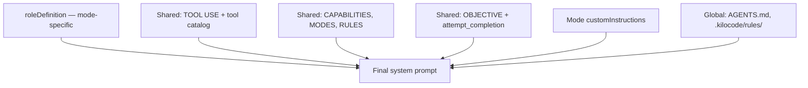
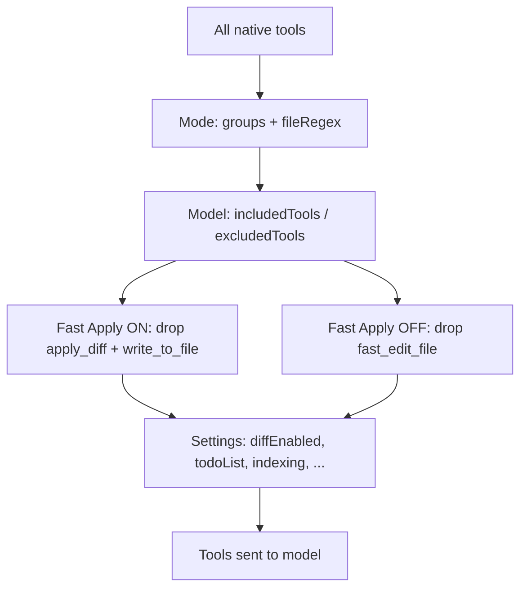

# Kilo Code system prompts: reconciled findings

Reconciled notes from analysis of extracted IntelliJ system prompts (`exploring-docs/system-prompts/`), the brainstorm in `exploring-docs/explore-brainstorm.md`, and the Kilo Code source tree. Focus: what can be improved via mode/prompt configuration vs what requires harness or infrastructure changes — especially for **GPT-5.1 on Azure** in a regulated Spring Boot / Maven environment.

---

## Sources

| Source | Role |
|--------|------|
| `exploring-docs/system-prompts/code-mode.md` (and ask/architect/debug) | Runtime prompts exported from default IntelliJ install |
| `exploring-docs/system-prompts/custom-modes-docs.md` | Custom mode / agent configuration reference |
| `exploring-docs/explore-brainstorm.md` | Original ZKB concerns (chat-only edits, Maven deps) |
| `packages/types/src/mode.ts` | Built-in mode definitions |
| `src/core/prompts/system.ts` | Prompt assembly |
| `src/core/prompts/tools/filter-tools-for-mode.ts` | Per-session tool filtering |
| `packages/types/src/providers/openai.ts` | GPT-5.x model tool preferences |

---

## How the system prompt is built

A mode prompt is **not** one file. It is assembled in layers:



**Entry points:** `src/core/webview/generateSystemPrompt.ts` → `src/core/prompts/system.ts`

Roughly **90% of each mode prompt is identical**. Meaningful per-mode differences:

| Mode | `roleDefinition` gist | Tool groups | Edit restriction |
|------|----------------------|-------------|------------------|
| **Code** | Skilled software engineer | read, edit, command, browser, mcp | All files |
| **Debug** | Systematic debugger | same as Code | All files |
| **Architect** | Planner / technical lead | read, edit (`.md` only), browser, mcp | **Markdown only** |
| **Ask** | Q&A assistant | read, browser, mcp | **No edit tools** |

**Customization surfaces** (highest impact first for enterprise):

| Surface | Scope | What it changes |
|---------|-------|-----------------|
| Organization-managed modes | Enterprise-wide | `roleDefinition`, `customInstructions`, tool groups |
| `.kilocodemodes` / `custom_modes.yaml` | Project or global | Same as above |
| `.kilocode/rules/*.md`, `AGENTS.md` | Project | Appended under USER'S CUSTOM INSTRUCTIONS |
| UI: mode prompt overrides | Per-mode | `roleDefinition` / `customInstructions` |
| Override built-in `code` agent | `kilo.jsonc`, `.kilo/agents/code.md` | Prompt body, model, permissions, `steps` |

Precedence on slug collision: **organization → project → global → built-in**.

**Footgun:** `.kilocode/system-prompt-{mode}` **replaces** the full assembled prompt (tool catalog, RULES, OBJECTIVE stripped). Avoid unless you manually re-include tool instructions.

---

## Original concerns (explore-brainstorm.md)

### Symptom 1: Proposes edits in chat but does not apply them

**Root causes (architectural, not just prompt):**

1. **Completion is self-reported.** `OBJECTIVE` requires `attempt_completion` when done (`src/core/prompts/sections/objective.ts`). `AttemptCompletionTool` blocks only if a tool failed in the current turn — not if files were never edited.
2. **Wrong mode.** Architect can edit only `.md`; Ask has no edit group. Chat-only code proposals in those modes are expected.
3. **One tool per turn.** Prompt enforces exactly one tool call per response; multi-file work needs many round-trips. Models may describe remaining files and call `attempt_completion` early.
4. **No tool call = no apply.** New tasks use **native tool calling only** (`src/utils/resolveToolProtocol.ts`). Prose in chat is not parsed into edits. After repeated no-tool turns → `MODEL_NO_TOOLS_USED` (`src/core/task/Task.ts`).
5. **Model / provider reliability.** GPT-5.1 on Azure must emit valid `tool_calls` JSON; failures are harness-level, not fixable by prompt alone.

**Fixable via prompt/mode (partial):** strict Code-mode `customInstructions`, `.kilocode/rules/`, correct mode selection, optional `update_todo_list` tracking, raising consecutive mistake limit (default 3).

**Not fixable via prompt alone:** native function-calling failures, no verification that all planned files were edited, no automatic “chat diff → apply” fallback.

### Symptom 2: Does not explore Maven / internal dependencies

**Built-in prompt:** one generic line in RULES — “looking at a project's manifest file” (`src/core/prompts/sections/rules.ts`). **No** Maven, `pom.xml`, JAR resolution, or source-JAR download instructions in core prompts.

**What the agent can do:** `read_file` on `pom.xml`, `search_files` / `codebase_search`, `execute_command` (e.g. `mvn dependency:tree`) if allowed.

**What it cannot do by design:** resolve IntelliJ External Libraries, download JARs from Nexus, index dependency APIs unless files exist on disk in the workspace.

**Project-level pattern in this repo:** `maven-deps-catalog/` — pre-generate `javap -public` signatures into `.kilocode/deps-api/` + rules in `.kilocode/rules/maven-deps-api.md`. Enable Codebase Indexing for `*.sig.txt`.

---

## Custom instructions: compatibility with Code mode

Proposed enterprise rules (apply via tools, todos per file, list modified files in `attempt_completion`, retry on edit failure) **do not contradict** the built-in Code prompt. They **tighten** under-specified behavior:

| Custom rule | Built-in prompt | Relationship |
|-------------|-----------------|--------------|
| Never describe edits only in chat | TOOL USE: native format; do not mimic tool calls in text | Reinforcement |
| All files edited before `attempt_completion` | RULES/OBJECTIVE: call `attempt_completion` when task complete | Stricter completion gate |
| List modified files in completion | RULES: no questions in completion text | Compatible |
| Todo per file | Not required in Code mode (unlike Architect) | Additive |
| Retry after edit failure | Tool guidelines: react to failures | Reinforcement (scope to **file-edit** tools, not `execute_command`) |

**Soft tensions to avoid in custom text:**

1. **Fast Apply on** → RULES inject “ONLY use `fast_edit_file`”. Listing `apply_diff` / `write_to_file` as options can confuse when those tools are removed from the schema.
2. **`update_todo_list`** may be disabled in settings — soften to “if available”.
3. **GPT-5.1** excludes `apply_diff` and `write_to_file` — naming them in custom instructions is misleading for that model.

**Reconciled custom instruction (model-agnostic):**

```yaml
customInstructions: |-
  IMPLEMENTATION RULES (mandatory):
  - Never describe a code change only in chat. Every file change MUST be applied via a file-edit tool
    (use whichever edit tool is available in this session).
  - For multi-file tasks: track each file (update_todo_list if available). Edit one file per turn;
    do not call attempt_completion until every planned file is edited.
  - In attempt_completion, list every file path actually modified in this task.
  - If a file-edit tool call fails, read_file first and retry. Do not skip remaining files.
  - Do not call attempt_completion while any planned file edit exists only in chat text.
```

No change to built-in `code-mode` sections is required for compatibility; customization belongs in `customInstructions` / rules files.

---

## Edit tools: what exists vs what is actually available

Kilo defines **multiple** edit tools; each session exposes a **filtered subset**.

### Tools defined (edit group)

| Tool | Model supplies | How Kilo applies |
|------|----------------|------------------|
| `apply_diff` | `path` + SEARCH/REPLACE blocks | Fuzzy match → splice (`MultiSearchReplaceDiffStrategy`) |
| `edit_file` | `file_path`, `old_string`, `new_string` | Literal replace + whitespace-tolerant fallbacks |
| `write_to_file` | `path`, full `content` | Full file overwrite |
| `fast_edit_file` | `target_file`, `instructions`, `code_edit` | Morph/Relace apply API → merged file written |
| `apply_patch` | Codex-style `*** Begin Patch` text | `parsePatch` → hunks → per-file write |
| `search_replace` / `search_and_replace` | Same family as `edit_file` | Opt-in per model |

Registered in `src/core/prompts/tools/native-tools/index.ts`; grouped in `src/shared/tools.ts` → `TOOL_GROUPS.edit`.

### Filtering pipeline



**Per mode:** Ask = no edit tools; Architect = edit `.md` only; Code/Debug = full edit.

**Fast Apply** (`filter-tools-for-mode.ts`):

- ON → remove `apply_diff`, `write_to_file`; prompt says use `fast_edit_file` only
- OFF → remove `fast_edit_file`

### GPT-5.1 (including Azure OpenAI-compatible)

From `packages/types/src/providers/openai.ts`:

```yaml
includedTools: ["apply_patch"]
excludedTools: ["apply_diff", "write_to_file"]
```

Typical **Code mode + GPT-5.1** edit tools:

| Tool | Available? |
|------|------------|
| `apply_patch` | Yes (preferred for this model family) |
| `edit_file` | Yes (default in edit group) |
| `fast_edit_file` | Only if Fast Apply/Morph configured |
| `apply_diff` | No |
| `write_to_file` | No |

OpenRouter-style routers apply similar preferences via `src/api/providers/utils/router-tool-preferences.ts` for `openai/*` models.

**Implication:** Custom instructions that list `apply_diff, write_to_file, fast_edit_file` are **not** accurate for GPT-5.1. Prefer “whichever edit tool is available” or name `apply_patch` and `edit_file` explicitly for that deployment.

---

## How changes are extracted and applied (GPT-5.1)

### Extraction: native tool calls, not chat text

For new tasks, `resolveToolProtocol()` always returns **native** (`TOOL_PROTOCOL.NATIVE`). XML-in-chat is deprecated except for resumed legacy tasks.

Flow:

1. Model returns API `tool_calls` with streamed JSON `arguments`
2. `NativeToolCallParser` accumulates and parses JSON → `ToolUse`
3. `presentAssistantMessage` validates mode/model → dispatches to `*Tool` handler
4. If the model outputs **only prose** → no extraction; harness may retry / `MODEL_NO_TOOLS_USED`

GPT-5.1 does **not** normally emit SEARCH/REPLACE in message body; it emits structured tool calls (e.g. `apply_patch` with patch string, or `edit_file` with old/new strings).

### Application by tool

| Tool | Apply path |
|------|------------|
| `apply_diff` | `ApplyDiffTool` → `diffStrategy.applyDiff()` on file content |
| `edit_file` | `EditFileTool` → string replace → write |
| `write_to_file` | `WriteToFileTool` → full write |
| `apply_patch` | `ApplyPatchTool` → `parsePatch` / `processAllHunks` |
| `fast_edit_file` | `editFileTool` (kilocode) → external Morph/Relace API → write result |

User approval (unless auto-approve/yolo) sits between tool execution and disk write.

---

## Three-layer mental model

| Layer | Question | GPT-5.1 failure modes |
|-------|----------|------------------------|
| **1. Harness** | Did the model emit a `tool_call`? | Chat-only proposals; no apply |
| **2. Policy** | Which edit tools are in the schema? | Wrong tool named in custom instructions; Architect/Ask mode |
| **3. Mechanism** | Did patch/diff/replace apply cleanly? | `apply_patch` parse errors; `edit_file` old_string mismatch |

---

## Recommendations for ZKB / enterprise rollout

### Highest ROI without forking the plugin

1. **Enterprise Code mode** with reconciled `customInstructions` above (org-managed mode or `.kilocodemodes`).
2. **Train mode selection:** Architect plans → **Code** implements; never expect source edits in Architect/Ask.
3. **Deploy `maven-deps-catalog/`** per Spring Boot repo; commit `.kilocode/deps-api/` or generate in CI; enable Codebase Indexing.
4. **Add `.kilocode/rules/maven-deps-api.md`** (template in `maven-deps-catalog/templates/`).
5. **Audit settings:** Fast Apply on/off, consecutive mistake limit, default mode, `diffEnabled`.

### Metrics to track (fixed prompt set)

- % of proposed changes written to disk vs left in chat
- % of multi-file tasks where all planned files were edited
- % of unknown dependency symbols resolved with vs without deps catalog

### When to look beyond prompts

- Persistent `MODEL_NO_TOOLS_USED` on Azure GPT-5.1 → provider / tool-calling path (`src/api/providers/openai.ts`, native parser)
- Partial file edits with no completion check → product change (`AttemptCompletionTool`, task loop verification)
- IntelliJ External Libraries without on-disk sources → `maven-deps-catalog` or MCP (see `exploring-docs/kilo-code-intellij.md`)

---

## Key source files

| Topic | Path |
|-------|------|
| Mode definitions | `packages/types/src/mode.ts` |
| Prompt assembly | `src/core/prompts/system.ts` |
| Tool filtering | `src/core/prompts/tools/filter-tools-for-mode.ts`, `src/core/task/build-tools.ts` |
| Native protocol | `src/utils/resolveToolProtocol.ts` |
| Tool call parsing | `src/core/assistant-message/NativeToolCallParser.ts` |
| GPT-5.x tool prefs | `packages/types/src/providers/openai.ts` |
| Maven deps workaround | `maven-deps-catalog/README.md` |
| Extracted prompts | `exploring-docs/system-prompts/` |

---

## Summary

| Concern | Prompt/mode helps? | Needs code/infra? |
|---------|-------------------|-------------------|
| Chat instead of file edits | **Partially** — strict Code rules, correct mode | **Yes** — completion verification, tool-call reliability |
| Unknown Maven/internal APIs | **Yes** — rules + `maven-deps-catalog` | **Yes** — native JAR/source resolution not in product |
| Custom instruction vs built-in prompt | **Compatible** — no built-in edit required | Tune wording per model (GPT-5.1 → `apply_patch` / `edit_file`) |
| “All edit tools available” | **No** — filtered by mode × model × Fast Apply | Document actual tool set per deployment |
