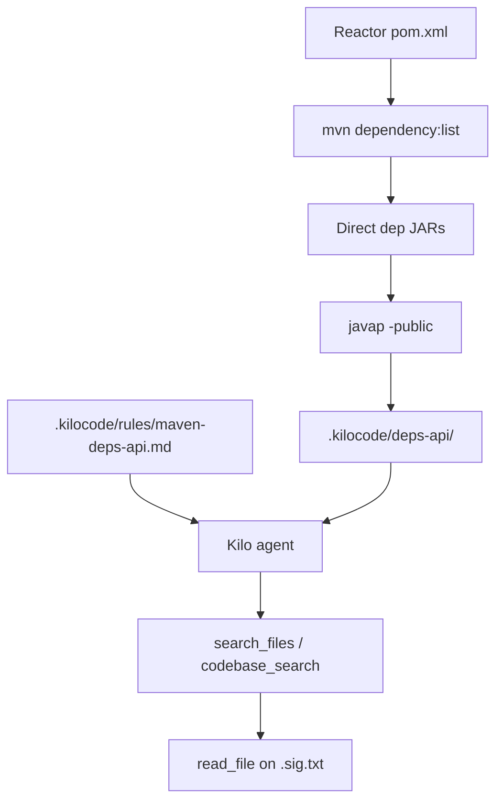

# Maven Dependency API Catalog

Self-contained toolkit that gives the Kilo agent **searchable, compact public signatures** for Maven dependency types — especially interfaces and classes that only appear under IntelliJ *External Libraries*, without unpacking full source JARs into the workspace.

Copy this folder into any Maven / Spring Boot project and run the generator. Nothing else in the Kilo Code repo is required.

## What you get

| Piece | Role |
|-------|------|
| `generate-deps-api.sh` | Resolves direct Maven deps and runs `javap -public` into `.kilocode/deps-api/` |
| `deps-api.config.yml.example` | Knobs: direct-only, include/exclude, modules, class cap |
| `templates/maven-deps-api.md` | Agent rule: search catalog first; never invent dep APIs |
| `templates/AGENTS.md.snippet` | Short pointer for project `AGENTS.md` |
| `LICENSE-NOTES.md` | Copy freely; respect dependency licenses for generated output |

## End-state layout (in your Maven project)

```
your-maven-project/
├── pom.xml
├── AGENTS.md                      # append AGENTS.md.snippet
├── .kilocodeignore                # must NOT hide deps-api
├── .kilocode/
│   ├── rules/
│   │   └── maven-deps-api.md
│   ├── deps-api/                  # GENERATED
│   │   ├── INDEX.md
│   │   ├── MANIFEST.json
│   │   └── by-artifact/
│   │       └── group_artifact_version/
│   │           ├── CLASSES.txt
│   │           └── com/example/Type.sig.txt
│   └── deps-api.config.yml
└── scripts/
    └── generate-deps-api.sh
```



## Setup (one-time)

From a Spring/Maven project root:

```bash
# 1. Copy toolkit pieces
mkdir -p scripts .kilocode/rules
cp /path/to/maven-deps-catalog/generate-deps-api.sh scripts/
chmod +x scripts/generate-deps-api.sh
cp /path/to/maven-deps-catalog/deps-api.config.yml.example .kilocode/deps-api.config.yml
cp /path/to/maven-deps-catalog/templates/maven-deps-api.md .kilocode/rules/
# Append templates/AGENTS.md.snippet to AGENTS.md (create the file if needed)
```

2. **Do not** ignore the catalog in `.kilocodeignore`:

```gitignore
# OK to ignore other .kilocode caches — but keep deps-api readable:
# .kilocode/deps-api/    ← DO NOT ADD THIS
```

3. Generate:

```bash
./scripts/generate-deps-api.sh
# or: MODULE=my-app ./scripts/generate-deps-api.sh
# or: ./scripts/generate-deps-api.sh -f path/to/pom.xml
```

4. **Enable Codebase Indexing** in Kilo after the first generate so `codebase_search` can find `*.sig.txt`.

5. Prefer **committing** generated `.kilocode/deps-api/` for IntelliJ + Kilo (catalog churn vs. every clone regenerating).

## Prerequisites

| Tool | Notes |
|------|--------|
| `mvn` | On `PATH` |
| JDK 17+ | `javap` / `jar` on `PATH`, or set `JAVA_HOME` |
| Bash | macOS/Linux shell; on **Windows** use **Git Bash** or **WSL** |

The script fails with a clear message if `mvn`, `javap`, or `jar` is missing.

## Config reference

Edit `.kilocode/deps-api.config.yml` (from the example):

| Key | Purpose | Recommendation |
|-----|---------|----------------|
| `directOnly` | Skip transitive deps when `true` | Keep `true` — smaller, more relevant catalog |
| `maxClassesPerArtifact` | Cap `javap` calls per JAR | `400` default; raise for huge Spring jars if needed |
| `modules` | Reactor module paths / artifact filters | `[]` = auto-discover `<module>` from root `pom.xml`, else `.` |
| `includeArtifacts` | Allowlist (`groupId:artifactId`, `artifactId`, or `prefix*`) | Empty = all direct deps |
| `excludeArtifacts` | Denylist (same patterns) | Exclude lombok/test libs (example does this) |
| `outputDir` | Catalog root | `.kilocode/deps-api` |

| Project file | Purpose | Recommendation |
|--------------|---------|----------------|
| `.kilocode/rules/maven-deps-api.md` | When/how the agent uses the catalog | Required; never invent dep APIs; never hand-edit `deps-api/` |
| `AGENTS.md` | Short pointer | Point at catalog + regen script |
| `.kilocodeignore` | Blocks agent reads | **Do not** ignore `.kilocode/deps-api/` |
| Codebase Indexing | Powers `codebase_search` | Enable after first generate |
| Git | Catalog size/churn | Prefer committing generated `deps-api` for IntelliJ+Kilo |

## Script behavior

1. Detect reactor root (`pom.xml`); support `-f` / `MODULE` env filter.
2. Per module: `mvn dependency:list -DexcludeTransitive=true -DoutputAbsoluteArtifactFilename=true` (when `directOnly: true`).
3. Apply include/exclude filters; skip `test` scope.
4. For each allowed JAR: folder `groupId_artifactId_version`, write `CLASSES.txt`, run `javap -public` → package-path `*.sig.txt`.
5. Write aggregate `INDEX.md` + `MANIFEST.json`.
6. Idempotent: wipe/rebuild `by-artifact/`; leave rules and config untouched.

## Agent workflow (expected)

1. Need a Spring/library method? Search `.kilocode/deps-api/` first.
2. Use `INDEX.md` / `CLASSES.txt` to locate the FQCN, then read the `.sig.txt`.
3. If missing: ask to regenerate or widen config — do not invent signatures.

## Regenerating

Run again after `pom.xml` / dependency changes:

```bash
./scripts/generate-deps-api.sh
```

## Windows notes

- Use **Git Bash** or **WSL**, not `cmd.exe`.
- Ensure `mvn` and `JAVA_HOME` point at Windows JDK installs that the shell can invoke (`javap -version` should work).
- Artifact paths from Maven are consumed as returned; prefer WSL or Git Bash path styles consistently.

## Out of scope

- JetBrains library-root wiring or VS Code/IntelliJ plugin changes  
- Unpacking full dependency sources into the workspace  
- Defaulting to full transitive closure (`directOnly: false` is opt-in)  
- Cross-links into other Kilo documentation in this repo  

## Acceptance (toolkit completeness)

- [x] Folder is self-documented (`README.md`)
- [x] Script + config example + templates + license notes
- [x] Ready to copy into a Maven repo and produce `.kilocode/deps-api/INDEX.md` + `*.sig.txt`
